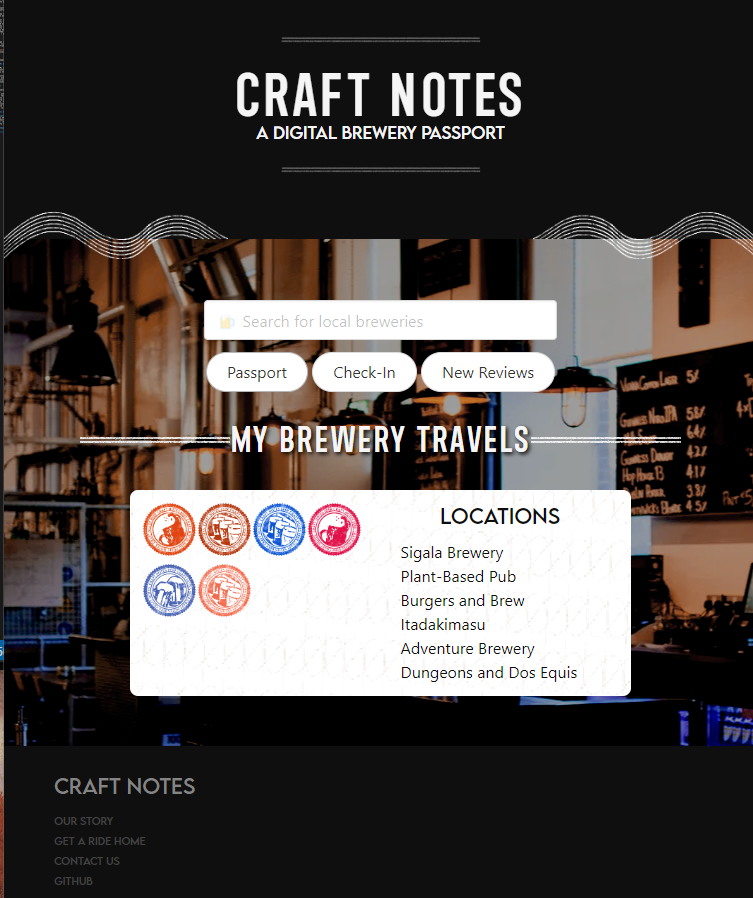

# Craft-Notes

> **Craft Notes** is a *Digital Brewery Passport* application built using HTML, CSS, and JavaScript.

The deployed repository can be found at the following url: 

## User Story

Craft beer enthusiasts are able to search for local breweries by location. The user will be able to submit feedback via input form, which will be saved as a passport themed profile. Their saved profiles will contain their brewery travels, passport stamps earned, as well as both beer and facility reviews. Which can be accessed at any time by logging into the app.

A digital passport stamp is earned when the user meets the following criteria: checking in to the brewery they are visiting and submitting a review of their beer of choice.

A digital stamp is populated and saved in their passport for that brewery, once all guidelines are met by the craft enthusiast.

**AS a craft beer enthusiast**
*I would like to search for local breweries where I am located*
	- CHECK IN at a location
	- SEARCH by location
*I would like to save my brewery travels and experience*
	- SELECT a beer or flight and store data
	- TAKE NOTES about experience
	- RECEIVE / SELECT a digital stamp after completing a prompt

### Wireframe

The below image is the initial wireframe for the project that gave the basic framework for aesthetic vision, user inteface, and conceptual logic. Various features were changed from the wireframe in alignment with adaptive and flexible processes.

## Features

The deployed application and repository contains the following features:

### UI/UX (HTML & CSS)

* Semantic HTML structuring for accessibility.
* Guided comments along HTML, CSS, and JavaScript files to navigate structure.
* Thirty-Party CSS Frameworks, including:
  * Bulma
  * DaFont (installed in assets)
* Media query and flexboxes for various resolutions and devices.
* Consistent styling, including fonts and coloring.
* IDs that connect elements to functions to allow different cards to print to the screen.

### JavaScript

* Global variables that reference elements, including classes and IDs, on HTML page for DOM traversal.
* Appends IDs and elements on the HTML page, and removes/add classes.
* Connects to Third Party API, BeerMapping, to allow users to search for breweries in a designated city location. 
* Check-In form allows collection of data to be stored in a string, including: Brewery Location, Date, Type of Beer, Rating.
* Utilizes localStorage to store data to be printed to the Passport page to reference where they have traveled.
* Stores data to Firebase, where data is fetched and published to the Reviews section.

### Third-Party APIs

* **BeerMapping** (https://beermapping.com/): A project that collects location of Breweries. The API enables the user to search for breweries in cities, and provide more information about the brewery.
* **FireBase** (https://firebase.google.com/): An API hosting service that allows users to publish data to a data-base.

## Installation

Clone a copy of the repository by going to the repo code and select **Code**. In the drop-down menu, select the method of cloning. To copy directly into the terminal, type `git pull` with the SSH key on the .git file to clone locally.

* HTTPS: `https://github.com/tcook160/Craft-Notes.git`
* SSH: `git@github.com:tcook160/Craft-Notes.git`

## Future Iterations

The website could expand to incorporate the following features:

* Adjust media-query for images at lower resolutions and devices, including the bars.
* Improve search results processes, including:
* * Clicking the title/button will display more information in the right-hand side, and pre-load some of the brewery information into the check-in form.
* * Create more specific search queries, including narrowing down city and paginating search results.
* * Save search result history for user ability to bookmark or create a road-map.
* Improve passport functions, including:
* * Clicking on a stamp allows the user to see the details of their entry that was published in the form.
* * Connect Firebase to the user's passport.
* Improve Check-In form, including:
* * Collecting more affective data and information.
* Update graphics for media query at lower resolutions.
* Build out user login and account information.

## Credits

This repository was developed for the UC Davis Fullstacks Bootcamp under the UC Davis Continuing and Professional Education.